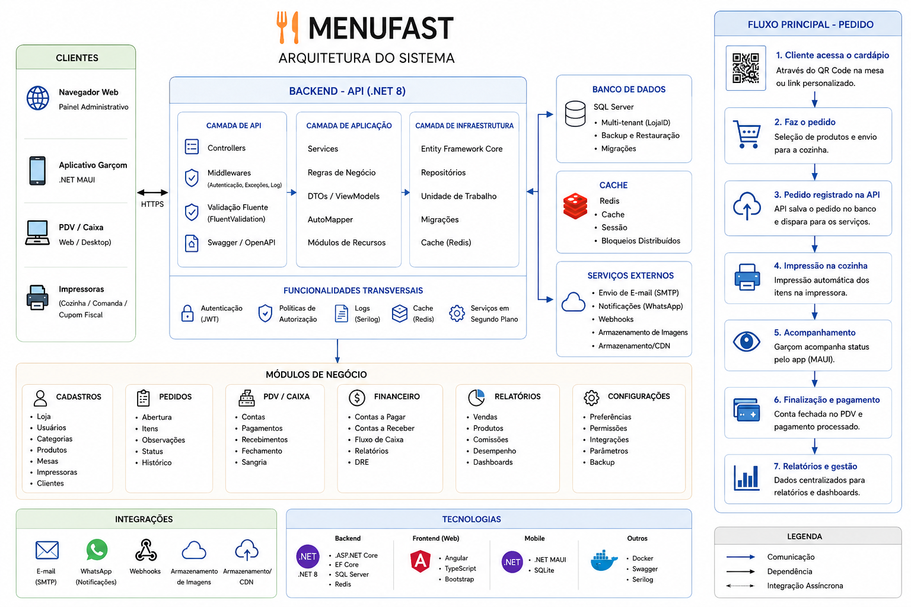

# 🍔 MenuFast

<p align="center">
  <strong>Sistema de gestão para restaurantes, lanchonetes e estabelecimentos alimentícios.</strong>
</p>

<p align="center">
  
</p>

---

## 📌 Sobre o projeto

O **MenuFast** é uma plataforma de gestão para restaurantes desenvolvida para centralizar as principais operações do estabelecimento em um único sistema.

A solução foi projetada para oferecer recursos como:

- 🏪 Gestão de lojas
- 📦 Produtos e categorias
- 🛒 Pedidos
- 🪑 Mesas
- 👨‍🍳 Operação de cozinha
- 🖨️ Impressão
- 💳 Integração com pagamentos
- 📱 Aplicativo para garçons
- 🔐 Autenticação e autorização
- 🔄 Arquitetura multi-tenant

---

## 🏗️ Arquitetura

O MenuFast utiliza uma arquitetura composta por aplicações web, API, banco de dados, cache, aplicativo mobile e serviços locais.

A arquitetura completa do sistema pode ser visualizada no diagrama acima.

---

## 🧩 Projetos

### MenuFast API

API principal responsável pelas regras de negócio, autenticação, gerenciamento dos dados e comunicação com o banco de dados.

**Tecnologias:**

- C#
- .NET
- ASP.NET Core
- Entity Framework Core
- SQL Server
- Redis
- JWT
- Swagger

### MenuFast Web

Aplicação web utilizada para gerenciamento do restaurante.

**Tecnologias:**

- Angular
- TypeScript
- PrimeNG
- Bootstrap
- HTML
- CSS

### MenuFast.Agent

Aplicação responsável pela comunicação entre o MenuFast e dispositivos locais, principalmente impressoras.

### MenuFast MAUI

Aplicativo mobile destinado aos garçons, permitindo realizar operações relacionadas aos pedidos.

**Tecnologia:**

- .NET MAUI

---

## 🔐 Segurança

A API utiliza autenticação baseada em **JWT** para controle de acesso aos recursos do sistema.

Principais mecanismos:

- Autenticação de usuários
- Autorização
- Controle de permissões
- JWT
- Controle de sessão
- Bloqueio após tentativas de login
- Blacklist de tokens
- Proteção dos endpoints

---

## 🏪 Multi-tenant

O MenuFast foi projetado para trabalhar com múltiplas lojas.

Cada loja possui seus próprios dados e configurações, permitindo que diferentes estabelecimentos utilizem a mesma plataforma de forma isolada.

---

## 💳 Pagamentos

O sistema possui integração com provedores de pagamento através de APIs e **webhooks**.

Os webhooks permitem que a API receba automaticamente atualizações referentes às transações realizadas.

---

## 🖨️ Impressão

O **MenuFast.Agent** permite a comunicação entre o sistema e as impressoras instaladas localmente no estabelecimento.

Isso possibilita que a aplicação esteja hospedada em um servidor enquanto os dispositivos de impressão permanecem na infraestrutura local da loja.

---

## 🛠️ Tecnologias

| Tecnologia | Utilização |
|---|---|
| C# | Backend |
| .NET | Plataforma principal |
| ASP.NET Core | Web API |
| Entity Framework Core | ORM |
| SQL Server | Banco de dados |
| Redis | Cache, sessão e locks |
| Angular | Frontend |
| TypeScript | Frontend |
| PrimeNG | Interface |
| Bootstrap | Layout |
| .NET MAUI | Aplicativo mobile |
| JWT | Autenticação |
| Swagger | Documentação da API |
| Docker | Containerização |
| Git / GitHub | Versionamento |

---

## 📂 Estrutura do projeto

```text
MenuFast/
│
├── MenuFast.API/
├── MenuFast.Web/
├── MenuFast.Agent/
├── MenuFast.MAUI/
│
└── docs/
    └── arquitetura-menufast.png
